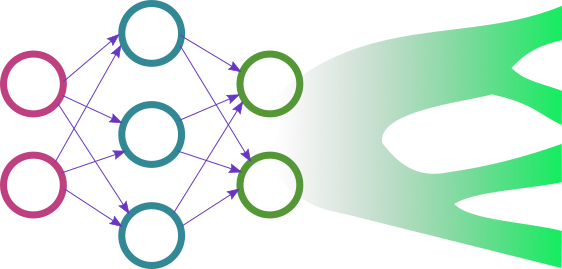
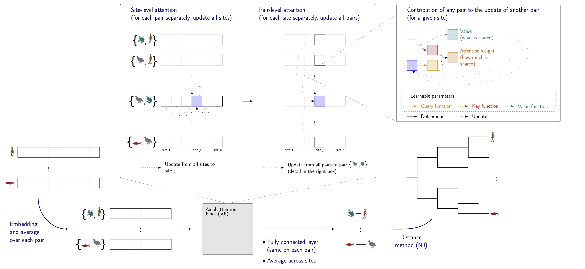

<p align="center">
  
</p>

# Phyloformer: towards fast, accurate and versatile phylogenetic reconstruction with deep neural networks
- Luca Nesterenko
- Luc Blassel
- Philippe Veber
- Bastien Boussau
- Laurent Jacob

This repository contains the scripts for [the paper](https://www.biorxiv.org/content/10.1101/2024.06.17.599404v1):

```bibtex
@article{10.1093/molbev/msaf051,
    author = {Nesterenko, Luca and Blassel, Luc and Veber, Philippe and Boussau, Bastien and Jacob, Laurent},
    title = {Phyloformer: Fast, accurate and versatile phylogenetic reconstruction with deep neural networks},
    journal = {Molecular Biology and Evolution},
    year = {2025},
    doi = {10.1093/molbev/msaf051},
    url = {https://doi.org/10.1093/molbev/msaf051},
}
```




Phyloformer is a fast deep neural network-based method to infer evolutionary distance from a multiple sequence alignment. 
It can be used to infer alignments under a selection of evolutionary models: LG+GC, LG+GC with indels, CherryML co-evolution model and SelReg with 
selection. 

## Running Phyloformer
You can read below for some example usage and explanations but if you just want the CLI reference of the available scripts you 
can see them in the [`cli_reference.md`](./cli_reference.md) file.

### Installing dependencies

The easiest way to install the software is by creating a virtual environment using conda/mamba and then installing dependencies in it:

```shell
# Install mamba if you want to use it instead of conda
conda install -n base -c conda-forge mamba

# Clone the phyloformer repo
git clone https://github.com/lucanest/Phyloformer.git && cd Phyloformer

# Create the virtual env and install the phyloformer package inside
conda create -n phylo python=3.9 -c defaults && conda activate phylo
pip install -r requirements.txt
```

Some pre-built binaries are included in this repo both for [linux AMD64](./bin/bin_linux/) and [macos ARM64](./bin/bin_macos/), these include:
- [`IQTree`](http://www.iqtree.org): for inferring maximum likelihood (ML) trees and simulating alignments *(For the alignment simulation to work you should use IQTree v2.0.0)*
- [`FastTree`](http://www.microbesonline.org/fasttree/): for inferring ML-like trees
- [`FastME`](https://gite.lirmm.fr/atgc/FastME): for inferring trees from distance matrices (such as the ones produced by phyloformer)
- [`goalign`](https://github.com/evolbioinfo/goalign): for manipulating alignments
- [`phylotree`](https://github.com/lucblassel/phylotree-rs): for manipulating newick formatted phylogenetic trees
- [`phylocompare`](https://github.com/lucblassel/phylocompare): for batch comparison of newick formatted phylogenetic trees
- [`pastek`](https://gitlab.in2p3.fr/pveber/pastek): for simulating alignments under the SelReg evolution model *(Only the macos binary is included, for linux please refer to the pastek repo for build instructions)*

If any of these executables do not run on your platform you can find more
information as well as builds and buil-instruction in the links to each tool's
repository.


### Using pre-trained models
All the named phyloformer models in the manuscript are given in the [`models`](./models/) directory:
- `PF_Base` trained with an MAE loss on LG+GC data
- `PF` fine-tuned from PF_Base with an MRE loss on LG+GC data
- `PF_Indel` fine-tuned from PF_Base with an MAE loss on LG+GC+Indels data
- `PF_Cherry` fine-tuned from PF_Base with an MAE loss on CherryML data
- `PF_SelReg` fine-tuned from PF_Base with an MAE loss on SelReg data

Use the [`infer_alns.py`](./infer_alns.py) script to infer some distance matrices from alignments using a trained Phyloformer model

Let's use the small test set given along with this repo to test out Phyloformer *(If you're on a macos ARM chip replace `bin_linux` with `bin_macos`)*. 
```shell
# First make sure you are in the repo and have the correct conda env
cd Phyloformer && conda activate phylo

# Infer distance matrices using the LG+GC PF model 
# (This will automatically use a CUDA GPU if available, otherwise it will use the CPU)
python infer_alns.py -o data/testdata/pf_matrices models/pf.ckpt data/testdata/msas

# Infer trees with FastME
mkdir data/testdata/pf_trees
for file in data/testdata/pf_matrices/*; do
  base="${file##*/}"
  stem="${base%%.*}"

  ./bin/bin_linux/fastme -i "${file}" -o "data/testdata/pf_trees/${stem}.nwk" --nni --spr
done

# Compare trees 
./bin/bin_linux/phylocompare -t -n -o data/cmp data/testdata/trees data/testdata/pf_trees

# Compute the average KF distance 
# It should output '0.333'
cat data/cmp_topo.csv | awk 'BEGIN {FS=","} NR>1{sum += $5; n+=1} END {printf "%.3f\n", sum/n}'
```


### Simulating data

#### Simulating trees
Simulate trees with [`simulate_trees.py`](./simulate_trees.py).  
Here we simulate 100 birth-death trees with 60 tips each and write them all to the `simulated_trees` directory:  

```shell
python simulate_trees.py --ntips 60 --ntrees 100 --output simulated_trees --type birth-death
```

#### Simulating LG+GC alignments
To do this you can use [`alisim.py`](./alisim.py), which calls IQTree's alisim under the hood. 
Here we simulate 123 amino acid long alignments from the trees generated above under an LG model with GC site heterogeneity. We write these alignments to the `simulated_alignments` directory: 

```shell
python alisim.py --outdir simulated_alignments --substitution LG --gamma GC --length 123 --allow-duplicate-sequences simulated_trees
```

If you want alignments that do not contain any duplicated sequences, you can remove the `--allow-duplicate-sequences` flag, the script will then retry generating alignments for a given tree until we have one with no duplicate sequences or until we reach the maximum number of retries specified by the `--max-attempts` flag.  

#### Example: simulating a full LG+GC testing set
Let us simulate a small testing set with different tree sizes:

```shell
# Create output directory
mkdir data/test_set

# Simulate 20 trees for each number of tips from 10 to 80 with a step size of 10
for i in $(seq 10 10 80); do
    python simulate_trees.py --ntips "$i" --ntrees 20 --output data/test_set/trees --type birth-death
done

# Simulate 250-AA long alignments using LG+GC from the simulated trees
# here we specify the iqtree binary given in this repo and we do not allow
# duplicate sequences in the MSAs we get as output
python alisim.py \
    --outdir data/test_set/alignments \
    --substitution LG \
    --gamma GC \
    --iqtree ./bin/bin_linux/iqtree_2.2.0 \
    --length 250 \
    --max-attempts 1 \
    data/test_set/trees
```

#### Simulating data under more realistic models
##### Adding Indels
This is done with the same script as normal `LG+GC` *(see [above](#simulating-lggc-alignments))* but adding the `--indel` flag

##### CherryML alignments
You can simulate alignments using the CherryML model by calling the [`simcherry.sh`](./bin/simcherry.sh) bash script, this call python scripts within `bin/simulateWithCoevolution/`.  
Here we simulate alignments unde the CherryML model for trees generated beforehand, we specify 500 amino acid long MSAs so it wil simulate 250 pairs of correlated sites, and write them to the `cherry_alignments` directory: 

```shell
./bin/simcherry.sh simulated_trees cherry_alignments 500
```

##### SelReg alignments
Similar to CherryML, there is a [`simselreg.sh`](./bin/simselreg.sh) bash script which calls the `pastek` binary included in this repository. It is called in the same way as the script above but you must also specify the path for the pastek binary *(in this instance in the `bin_macos` directory)*:  
```shell
./bin/simselreg.sh simulated_trees selreg_alignments 500 ./bin/bin_macos/pastek
```

**N.B** It is important to note that there is no process in place to deal with duplicate sequences in alignments within the `simcherry.sh` and the `simselreg.sh` scripts, you can do that on your own with external tools like [`goalign`](https://github.com/evolbioinfo/goalign), [`seqtools`](https://github.com/lucblassel/seqtools) or the following batch snippet which moves alignments without duplicates to the `no_dupes` directory:   

```bash
ALN_DIR=#PATH TO YOUR ALIGNMENTS

mkdir "$ALN_DIR/no_dupes" 

c=0
cd "$ALN_DIR"
for i in *.fasta; do
  num=$(echo $i | awk -F '_' '{print $2}')
  num=$((num * 2))
  j=$(sort $i | uniq | wc -l)
  if [[ $j -lt $num ]]; then
    c=$((c + 1))
  else 
    mv "$i" "$ALN_DIR/no_dupes"
  fi
done
cd - 
echo "$c trees/alignments with duplicates were removed"
```

### Training a Phyloformer model
Use the [`train_distributed`](./train_distributed.py) script to train or fine-tune a PF model on some data.
Training is done using a `lightning` wrapper, so make sure that is installed before attempting it. 
This script is made to run on a CUDA GPU within a SLURM environment but it should run fine on a personlal computer.   
*If you wish to train on modern ARM architecture Apple machines, the script will run on the CPU instead f the GPU because of a bug in the MPS implementation of `Elu()`.*

For this we will assume that you have your training data organized as follows:
```
data/
├── train/
│   ├── msas/
│   └── trees/
└── val/
    ├── msas/
    └── trees/
```
Note that the training script supports auto-splitting the data into training and validation sets, however for reproducibility purposes it is not recommended, especially if you intend to use checkpoints and resume training at a further point.  

**Important:** so that the data-loader knows which simulated alignment comes from which simulated tree, corresponding tree and alignment file pairs must have the same file name with differing extensions (`.nwk`/`.newick` for trees and `.fa`/`.fasta` for alignments). This means that if you have a `data/train/trees/0_20_tips.nwk` tree file you must have a corresponding `data/train/msas/0_20_tips.fa` alignment file.

#### Training from scratch

##### Basic example
Ok now that we have the correct data layout we can train a Phyloformer instance on our data. We wand to run this for 20 epochs, with 300 warmup steps on our learning-rate schedule at the end of which we reach the target starting learning-rate of $10^{-4}$ and a batch size of 4:  

```shell
python train_distributed.py \
    --train-trees data/train/trees \
    --train-alignments data/train/msas \
    --val-trees data/val/trees \
    --val-alignments data/val/msas \
    --warmup-steps 300 \
    --learning-rate 1e-4 \
    --nb-epochs 20 \
    --batch-size 4 \
    --check-val-every 1000
```

We also specify that we want to check the validation loss *(on the whole validation set)* every 1000 steps. Every time that the validation loss is estimated a model checkpoint is saved. Checkpoints are saved in a directory named `checkpoints_LR_...` that encodes the specifics of the current training run. In parallel to this, training logs are handled by [`wandb`]() and saved to the `wandb` directory. Since this script was designed to run on an offline SLURM cluster node, `wandb` logs are not automatically synced to the online platform and users must run `wandb sync` on the desired logs to upload them from a machine that has an internet connection *(e.g. the cluster's head node)*.   
`wandb` parameters like the project name and the run name can be user-specified with the `--project-name` and `--run-name` flags respectively. 
You can also specify the directory in which to save the checkpoints and the logs by using the `--output-dir` flag *(by default it is the current directory)*.

##### Specifying model architecture
In the previous command we trained a phyloformer instance with a default architecture *(6 attention blocks, with 64 embedding dimensions, 4 attention heads and 0.0 dropout)*. Each of these parametrs can be user-specified, e.g: 
```shell
python train_distributed.py \
    --nb-blocks 3 \
    --embed-dim 128 \
    --nb-heads 2 \
    --dropout 0.5 \
    ...
```

##### Training stopping conditions
Since training a phyloformer instance can be costly it is usually a good idea to set up sonme guardrails before launching training on several GPUs in parallel for several hours. 

The first thing to do is to set up the training schedule by defining the number of epochs, target learning rate and number of warmup steps *(see above)*. Once that is done you can control when the model stops training either:

- ***After a set number of steps*** with the `--max-steps` flag. This is useful if you want to stop training early but have a LR schedule that is defined over more steps. By default this is `None` meaning that the training will continue until the specified number of epochs is reached. 
- ***With early stopping conditions***
    - the `--no-improvement-stop`/`-n` flag can be used to set the number of validation steps for which there have been no improvement before stopping training. *(e.g. with `-n 5` if after measuring validaiton loss 5 times without improving performance at least once, then traininng stops.)*.
    - the `--hard-loss-ceiling`/`-L` flag sets a value that if the training or validation loss is ever above training stops immediately. 

#### Resuming training from a checkpoint
Resuming training from a saved checkpoint is meant to be intuitive, you just need to specify the data paths, checkpoint path and validation check interval. All model architecture, LR scheduling and early stopping parameters are contained in the saved checkpoint and will be applied automatically:

```shell
python train_distributed.py \
    --train-trees data/train/trees \
    --train-alignments data/train/msas \
    --val-trees data/val/trees \
    --val-alignments data/val/msas \ 
    --check-val-every 1000 \
    --load-checkpoint checkpoints_.../last.ckpt
```
the `...` in the checkpoints directory are to be replaced with you checkpoint directory depending on the previous run's trainig parameters.

#### Fine-tuning from a pre-trained model
Fine-tuning a previous model is much like training a model from scratch excepts we do not need to specify architecture parameters and we need to specify the path to the pre-trained base model that we want to fine tune:

```shell
python train_distributed.py \
    --train-trees data/train/trees \
    --train-alignments data/train/msas \
    --val-trees data/val/trees \
    --val-alignments data/val/msas \
    --warmup-steps 300 \
    --learning-rate 1e-4 \
    --nb-epochs 20 \
    --batch-size 4 \
    --check-val-every 1000 \
    --base-model path/to/pretrained/model.ckpt
```

This should cover all use cases for training, please refer to the [`cli_reference.md`](./cli_reference.md) file for all the flags or open an issue if you believe that something is missing.

### Reproducing figures
Use the [`make_plots`](./make_plots.py) script to reproduce all paper figures. 

```shell
# Download the results (This might take a little time since the file is quite large)
curl 'https://zenodo.org/records/13742527/files/results.tar.gz?download=1' -o results.tar.gz

# Extract results file (make sure you are in the repo root)
tar xzvf results.tar.gz 

# Run figure producing script (this should take 5 to 10 minutes)
python make_plots.py
```

