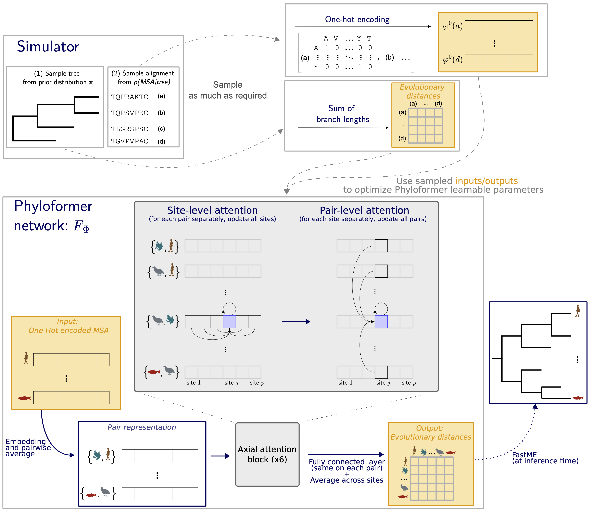

<p align="center">
  
</p>

# Phyloformer: Towards fast and accurate Phylogeny estimation with self-attention Networks

- Luca Nesterenko
- Bastien Boussau
- Laurent Jacob

This repository contains the scripts for [the paper](https://www.biorxiv.org/content/10.1101/2022.06.24.496975v1):


```bibtex
@article{Nesterenko2022phyloformer,
  author={Nesterenko Luca, Boussau Bastien, Jacob Laurent},
  title={Phyloformer: towards fast and accurate phylogeny estimation with self-attention networks},
  year={2022},
  doi={https://doi.org/10.1101/2022.06.24.496975},
  url={https://www.biorxiv.org/content/10.1101/2022.06.24.496975v1},
  journal={bioRxiv}
}
```



## Install
The easiest way to install the software is using mamba:

```
conda install -n base -c conda-forge mamba
mamba env create -f environment.yml
conda activate phylo
```

### Test run
To check that the installation is successful one can run

```
python phyloformer/predict.py ./testdata/alignments
```
and then 
```
python testdata/test.py
```
the printed mean normalized Robinson-Fould distance should be equal to 0.063.


## Usage

We provide the software as a ready to use tool for phylogenetic inference, one can simply run
```
python phyloformer/predict.py
```
providing as argument a directory containing multiple sequence protein alignments in .fasta format,
the program will then predict a phylogenetic tree for each alignment and write them in Newick format in the same directory.

If the user wishes to choose a different directory where the predictions will be saved he can specify it with the `--o` flag.

By default the Phyloformer model used for inference is the one trained on simulations based on the PAM model of evolution, a different model to use can be specified with the `--m` flag (the other one currently available being the one trained on [Evosimz](https://gitlab.com/ztzou/phydl/-/tree/master/evosimz) simulations).

Finally, if an NVIDIA gpu is available, `--gpu true` allows to exploit it offering a great speed up in inference.

## Simulations and training

To train the network one needs to simulate phylogenetic trees and alignments of sequences evolving along them.

### Simulating the trees
The trees can be generated with
```
python simulations/simulateTrees.py --nleaves <number of leaves in each tree> (default 20) --ntrees <number of trees> --type <tree topology> (default uniform) --o <output directory> --bl <branch lenght distribution> (default uniform)
```
The currently supported types of tree topologies are uniform (as in the paper, sampling uniformly from the tree topologies having nleaves), and birth-death (the tree is generated through a birth death process with a birth_rate of 1 and a death_rate of 0.5).

The currently supported types of branch length distribution are uniform (as in the paper, branch lenghts sampled uniformly between 0.002 and 1), and
exponential (branch lenghts sampled from an exponential distribution with a $\lambda$ parameter of 0.15)

Therefore to train the network just as in the paper one can create the tree dataset simply with
```
python simulations/simulateTrees.py --ntrees 100000 --o <output directory>
```
### Simulating the alignments
Currently the supported sequence simulator is [Seq-Gen](http://tree.bio.ed.ac.uk/software/seqgen/)

The alignments can be generated with
```
python simulations/simulateTrees.py --i <input directory with the .nwk tree files>  --o <output directory> --l <length of the simulated sequences> (default 200) --sg <path to Seq-Gen-1.3.4/source/> --m <model of evolution> (default PAM)
```

the possible models of evolution being those supported by Seq-Gen.

Again, to follow the paper one can just do

```
python simulations/simulateTrees.py --i <input directory with the .nwk tree files>  --o <output directory> --sg <path to Seq-Gen-1.3.4/source/>
```
### Creating a tensor dataset
```
python training/make_tensors.py --treedir <input directory with the .nwk tree files> --alidir <input directory with the corresponding .fasta alignment files>  --o <output directory> 
```
### Training the model
```
python training/train.py --i <input directory with the training tensors> --o <output directory where the models will be saved>  --c <json configuration file with hyperparameters>  --load (optional) <path to model to train further>
```
In the training directory one will find an example of configuration file, stdconfig.json, i.e. the one used to train the model in the paper.
## Reproducibility of the results in the paper
The datasets simulated using Seq-Gen are available at:

- PAM model: [https://plmbox.math.cnrs.fr/f/f5a2ed2667a841cba6f0/](https://plmbox.math.cnrs.fr/f/f5a2ed2667a841cba6f0/).
- WAG model: [https://plmbox.math.cnrs.fr/f/834248a35ba64752a6a4/](https://plmbox.math.cnrs.fr/f/834248a35ba64752a6a4/).

The simulations under the Evosimz model are available at [https://datadryad.org/stash/dataset/doi%253A10.5061%252Fdryad.rbnzs7h91](https://datadryad.org/stash/dataset/doi%253A10.5061%252Fdryad.rbnzs7h91).

## Disclaimer:

Phyloformer is still at the stage of the proof of concept. In
particular, we observed lower performances:

- For trees with more than 40 leaves. As discussed in the manuscript
  this will likely be fixed after we re-train on trees with larger
  evolutionary distances.

- For topologies generated under a birth-death model. The topologies
  used in the experiments reported in the manuscript were generated
  under the populate function of the ete3 package. We are still
  investigating the possible reasons for this discrepancy.

We are making the trained models available for transparency and would
be very interested to hear about cases where these models
underperform.
